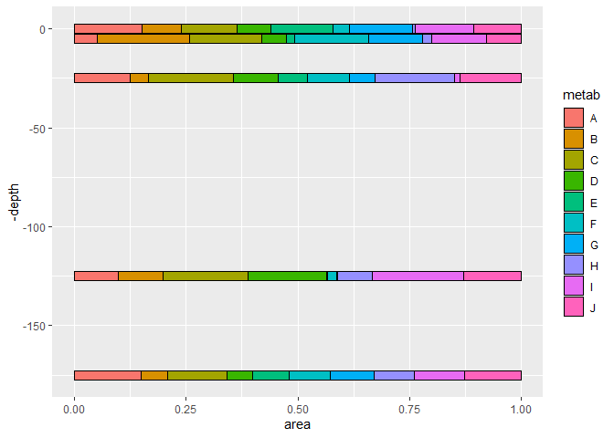
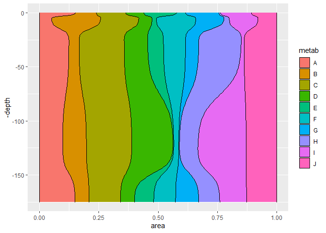
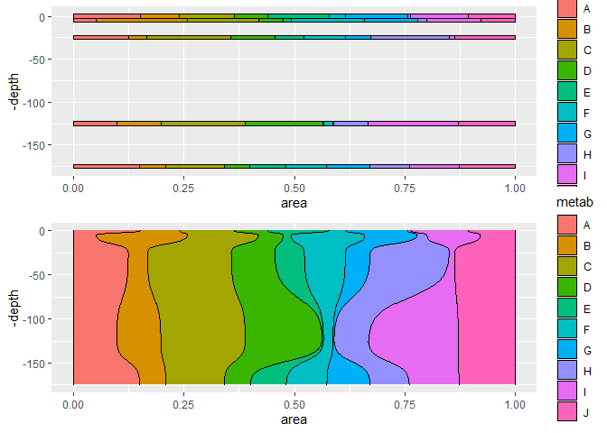

ggbarribbon
================

A small repo that implements a new geom for `ggplot2`:
`geom_bar_ribbon`. This geom interpolates smoothly between the values
that would normally be provided to geom_bar using a sigmoid curve.

Often, this is useful when a stacked bar plot is desired but the values
along the perpindicular axis are numeric rather than discrete. A numeric
axis often results in overplotting or weird spacing issues when the data
could instead be interpolated and show up more nicely.

``` r
# devtools::install_github("https://github.com/IngallsLabUW/ggbarribbon")
library(ggbarribbon)

metab_df <- data.frame(
  metab=LETTERS[1:10], 
  depth=rep(c(0, 5, 25, 125, 175), each=10),
  area=runif(50)
)
```

For example, the barplot below does a nice job of conveying changes in
relative metabolite abundance over depth, but the spacing on the y axis
is awful and results in a large amount of whitespace.

``` r
library(ggplot2)
ggbar <- ggplot(metab_df) +
  geom_bar(aes(y=area, x=-depth, fill=metab), stat = "identity", 
           position = position_fill(reverse = TRUE), color="black") +
  coord_flip()
ggbar
```

<!-- -->

Instead, with geom_bar_ribbon, the data can be smoothly interpolated so
that the whitespace is used and the trends between different depths are
much clearer.

``` r
ggbarribbon <- ggplot(metab_df) +
  geom_bar_ribbon(aes(y=area, x=-depth, fill=metab), color="black") +
  coord_flip()
ggbarribbon
```

<!-- -->

A direct comparison:

``` r
gridExtra::grid.arrange(ggbar, ggbarribbon)
```

<!-- -->

And of course, because it’s built within the ggplot2 family it’s
completely customizable:

``` r
ggbarribbon +
  geom_vline(xintercept = -metab_df$depth, lwd=1) +
  scale_y_continuous(labels = scales::percent) +
  theme_minimal() +
  theme(legend.position = "top",
        text = element_text(size = 18)) +
  labs(x="Depth (m)", y="Metabolite proportion", fill="Metabolite ID") +
  scale_fill_manual(values = LaCroixColoR::lacroix_palette("Pamplemousse", type="paired", n = 10))
```

<!-- -->

As another example, below I’ve recreated the plots of Figure 4 from
[Heal et al.,
(2020)](https://journals.asm.org/doi/full/10.1128/mSystems.01334-20)

``` r
options(readr.read_lazy = FALSE, readr.show_col_types = FALSE)
# Override normal read.csv to access correct standards list
old_stan_csv_url <- "https://raw.githubusercontent.com/IngallsLabUW/Ingalls_Standards/3e463eaa2cfd6d58a8b338a99b4d965f9a4d492e/Ingalls_Lab_Standards_NEW.csv"
read.csv <- function(text, header){
  utils::read.csv(old_stan_csv_url, header = TRUE)
}

# Download necessary files and mimic project workspace
base_url <- "https://raw.githubusercontent.com/kheal/Gradients1_SemiTargeted3"
sha <- "234f1753867385a978063f96cc6d9c0c67c248af"

dir.create("Intermediates")
longdat_file <- "Intermediates/Quantified_LongDat_Enviro.csv"
download.file(paste(base_url, sha, longdat_file, sep = "/"), destfile = longdat_file)
dir.create("MetaData")
metadat_file <- "MetaData/SampInfo_wMetaData_withUTC.csv"
download.file(paste(base_url, sha, metadat_file, sep = "/"), destfile = metadat_file)

dir.create("Figures/Manuscript_figures", recursive = TRUE)

source("https://raw.githubusercontent.com/kheal/Gradients1_SemiTargeted3/master/Figures/Code/BarPlots_molPerCent_C.R")

b_c_d.big
```

<!-- -->

``` r
unlink("Intermediates", recursive = TRUE)
unlink("MetaData", recursive = TRUE)
unlink("Figures", recursive = TRUE)
```

Instead, we can now use `geom_bar_ribbon` to interpolate smoothly
between the discrete data points. All that I’ve done with the code below
is to copy the original code directly and replace calls to `geom_bar`
with calls to `geom_bar_ribbon`. I then coerced the x-values out of
factor form because they can now be plotted as continuous variables. I
then also added the new `interp_res` argument to the first call because
its default is a single unit value (works great for depth profiles, not
for latitude).

``` r
AllSmps_long_Summary_Tran <- AllSmps_long_Summary_withOthers %>%
  filter(Cruise == "KOK1606") %>% 
  # Line below is new
  mutate(Latitude=as.numeric(levels(Latitude))[Latitude])

b.big <- ggplot(AllSmps_long_Summary_Tran, aes(x = Latitude, y = molFractionC, fill = MF_Frac))+
  # Line below is new
  geom_bar_ribbon(stat = "identity", color = "black", size = 0.2, interp_res = 10)+
  scale_y_continuous(expand = c(0, 0), limits = c(0,1))+
  scale_fill_manual(values = as.character(unique(AllSmps_long_Summary_Tran$Colors)),
                    guide = guide_legend(nrow=5, keyheight = 1, keywidth = 1 ))+
  labs(y= "mole fraction C")+
  theme(legend.title = element_blank(),
        legend.text = element_text(size = 6),
        legend.position="bottom",
        axis.title = element_text(size = 9),
        axis.text = element_text(size = 8))+
  coord_flip() 

#Plotting up the North Depth Profile -----
AllSmps_long_Summary_nDP <- AllSmps_long_Summary_withOthers %>%
  filter(Cruise ==  "MGL1704") %>%
  unique()

c.big <- ggplot(AllSmps_long_Summary_nDP, aes(x = as.numeric(Depth), y = molFractionC, fill = MF_Frac))+
  scale_x_reverse(breaks = rev(unique(as.numeric(AllSmps_long_Summary_nDP$Depth)))) +
  scale_y_continuous(expand = c(0, 0), 
                     limits = c(0,1))+
  geom_bar_ribbon(stat = "identity", color = "black", width = 15, size = 0.2) +
  scale_fill_manual(values = as.character(unique(AllSmps_long_Summary_nDP$Colors)),
                    guide = guide_legend(nrow=5,keyheight = 0.8, keywidth = 0.8 ))+
  labs(y= "mole fraction C", x = "Depth (m)")+
  guides(fill=FALSE) +
  theme(axis.title = element_text(size = 9),
        axis.text = element_text(size = 8))+
  coord_flip() 

#Plotting up the South Depth Profile -----
AllSmps_long_Summary_sDP <- AllSmps_long_Summary_withOthers %>%
  filter(Cruise ==  "KM1513") %>%
  unique()

d.big <- ggplot(AllSmps_long_Summary_sDP, aes(x = as.numeric(Depth), y = molFractionC, fill = MF_Frac))+
  scale_x_reverse(breaks = rev(unique(as.numeric(AllSmps_long_Summary_sDP$Depth)))) +
  scale_y_continuous(expand = c(0, 0), limits = c(0,1))+
  geom_bar_ribbon(stat = "identity", color = "black", width = 15, size = 0.2) +
  scale_fill_manual(values = as.character(unique(AllSmps_long_Summary_Tran$Colors)),
                    guide = guide_legend(nrow=5,keyheight = 0.8, keywidth = 0.8 ))+
  labs(y= "mole fraction C", x = "Depth (m)")+
  guides(fill=FALSE) +
  theme(axis.title = element_text(size = 9),
        axis.text = element_text(size = 8))+
  coord_flip() 

#Combine the plots 
c_d2.big <- plot_grid(c.big, d.big, ncol = 1, labels = c('', ''), label_fontface = "bold")
b_c_d.big <- plot_grid(b.big, c_d2.big, ncol = 2, labels = c('', ''), label_fontface = "bold")
b_c_d.big
```

<!-- -->

Interestingly, a few values are now shown to have hidden NAs (resulting
in the white patches), but the plots as a whole behave similarly. One
other note is that the plots arrange their fills from largest to
smallest, left to right, rather than the ggplot2 default of right to
left.

README last compiled on 2021-11-15.
