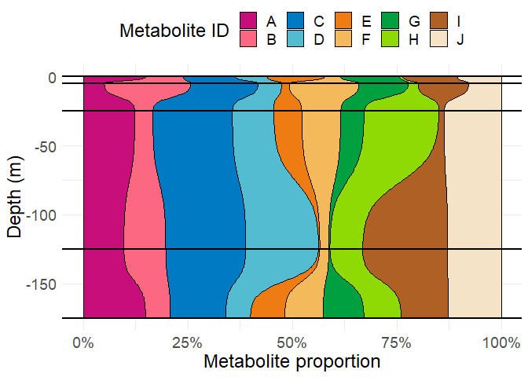

ggbarribbon
================

A small repo that implements a new geom for `ggplot2`:
`geom_bar_ribbon`. This geom interpolates smoothly between the values
that would normally be provided to geom_bar using a sigmoid curve.

Often, this is useful when a stacked bar plot is desired but the values
along the perpindicular axis are numeric rather than discrete. A numeric
axis often results in overplotting or weird spacing issues when the data
could instead be interpolated and show up more nicely.

``` r
# devtools::install_github("https://github.com/IngallsLabUW/ggbarribbon")
library(ggbarribbon)

metab_df <- data.frame(
  metab=LETTERS[1:10], 
  depth=rep(c(0, 5, 25, 125, 175), each=10),
  area=runif(50)
)
```

For example, the barplot below does a nice job of conveying changes in
relative metabolite abundance over depth, but the spacing on the y axis
is awful and results in a large amount of whitespace.

``` r
library(ggplot2)
ggbar <- ggplot(metab_df) +
  geom_bar(aes(y=area, x=-depth, fill=metab), stat = "identity", 
           position = position_fill(reverse = TRUE), color="black") +
  coord_flip()
ggbar
```

<!-- -->

Instead, with geom_bar_ribbon, the data can be smoothly interpolated so
that the whitespace is used and the trends between different depths are
much clearer.

``` r
ggbarribbon <- ggplot(metab_df) +
  geom_bar_ribbon(aes(y=area, x=-depth, fill=metab), color="black") +
  coord_flip()
ggbarribbon
```

<!-- -->

A direct comparison:

``` r
gridExtra::grid.arrange(ggbar, ggbarribbon)
```

<!-- -->

And of course, because it’s built within the ggplot2 family it’s
completely customizable:

``` r
ggbarribbon +
  geom_vline(xintercept = -metab_df$depth, lwd=1) +
  scale_y_continuous(labels = scales::percent) +
  theme_minimal() +
  theme(legend.position = "top",
        text = element_text(size = 18)) +
  labs(x="Depth (m)", y="Metabolite proportion", fill="Metabolite ID") +
  scale_fill_manual(values = LaCroixColoR::lacroix_palette("Pamplemousse", type="paired", n = 10))
```

<!-- -->

README last compiled on 2021-11-13.
